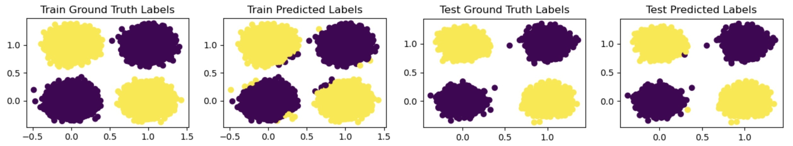
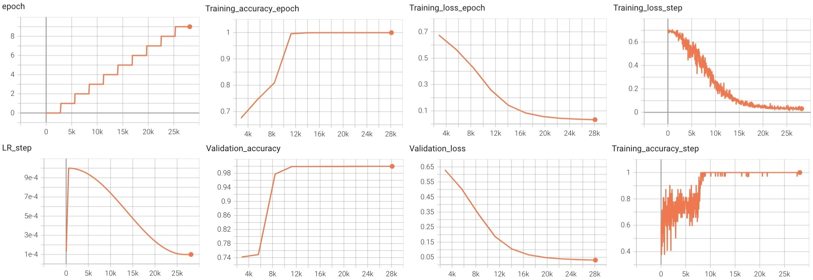

# ProjectX
ProjectX is a set of PyTorch scripts to facilitate training of deep neural networks for multi-CPU/GPU set-ups.

I've created this template based on the best practices I've learned on my deep learning odyssey. It's based on amazing [PyTorch Lightning](https://lightning.ai/pytorch-lightning) library with some more flexibility which is achieved by turning off automatic optimization and doing manual backward as can be seen in [src/training/lightning.py](src/training/lightning.py)


## How to use
If you want to train your model on CPU, use this command:
```
python src/main.py cpu
```
And in case you want to do this on GPU, use this command:
```
python src/main.py gpu
```
When you execute the main script, it creates a directory in [tb_log_dir](tb_log_dir) whose name corresponds to the date and Pacific time you've started running the main (20-10-2023--13-48-35 in my case) and all the tensorboard logs and checkpoints will be created inside that directory. Note that the main script uses the [config_cpu.yaml](configs/config_cpu.yaml) or [config_gpu.yaml](configs/config_gpu.yaml) based on your use case and starts training from scratch because the ckpt_path variable has been set to None in the config file. If you want to continue training from a specific checkpoint, you should replace None with the path to that checkpoint.

## Sample Dataset
In order to show how this template works I've created a very simple [XOR](https://en.wikipedia.org/wiki/Exclusive_or) dataset which includes 100,000 two dimensional binary inputs with some noise and their corresponding binary outputs. The train-test split ratio is 9 to 1. I have created this dataset using the scripts in [src/dataset/numpy_dataset.py](src/dataset/numpy_dataset.py). To see how I've created these plots, have a look at [notebooks/inference.ipynb](notebooks/inference.ipynb).




## Sample Learning Curves
Here are the learning curves for 10 epochs. The horizontal axis shows the step number. Validation happens at the end of each epoch. Note that how some of the curves are step-level while others are epoch-level. Also note that I've used Cosine annealing learning rate scheduling with some warm-up steps whcih I found to be super effective in many deep learning projects. You can see these graphs in your browser using this command:
```
tensorboard --logdir tb_log_dir/20-10-2023--13-48-35
```


